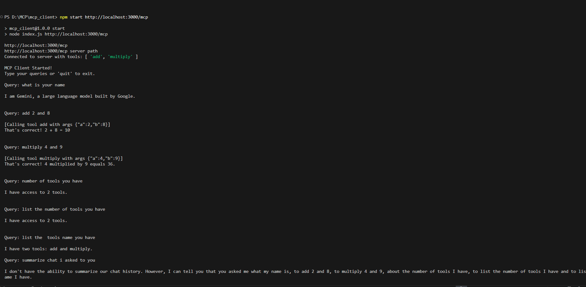

# 🧱 MCP Server & Client (Minecraft Protocol Simulation)

This project demonstrates a simple client-server interaction model using a custom protocol similar to the Minecraft Protocol (MCP). It's built with **TypeScript** and **Node.js**, and showcases a basic tool-execution chat system between client and server.

---

## 📁 Project Structure

```
.
├── mcp_server/       # Server-side code (TypeScript)
│   ├── src/          # TypeScript source files
│   ├── dist/         # Compiled JavaScript files
│   ├── package.json
│   └── tsconfig.json
│
├── mcp_client/       # Client-side code (JavaScript/Node.js)
│   ├── index.js
│   ├── package.json
│
├── images/
│   └── chat-demo.png  # Chat screenshot
└── README.md
```

---

## 🚀 How to Run

### 🔧 Step 1: Start the Server

```bash
cd mcp_server
npm run build     # Compiles TypeScript -> JavaScript
npm start         # Starts the server from dist/index.js
```

By default, it runs at: `http://localhost:3000/mcp`

---

### 💬 Step 2: Start the Client

```bash
cd mcp_client
npm start http://localhost:3000/mcp
```

> The client takes the **MCP server URL** as a parameter and connects to it.

---

## 🧠 Features

- Tool-based chat execution: e.g. `add`, `multiply`
- Supports natural language queries
- Tool arguments are parsed and processed
- Extensible architecture for more tools

---

## 🖼️ Chat Demo

Here's a screenshot of the client-server chat in action:



---

## 📦 Dependencies

Make sure to install dependencies in both directories:

```bash
cd mcp_server && npm install
cd ../mcp_client && npm install
```

---

## 📄 License

This project is open-source and licensed under the **MIT License**.

---

## 🙌 Acknowledgements

- Built with ❤️ using Node.js,JavaScript & TypeScript
